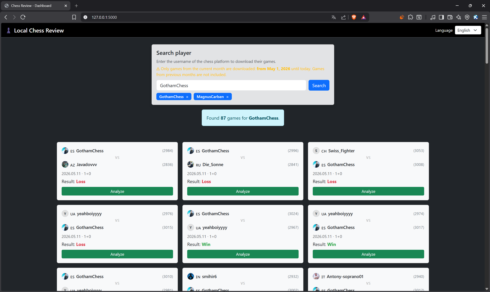
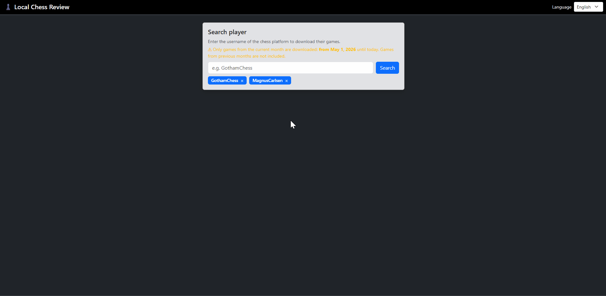
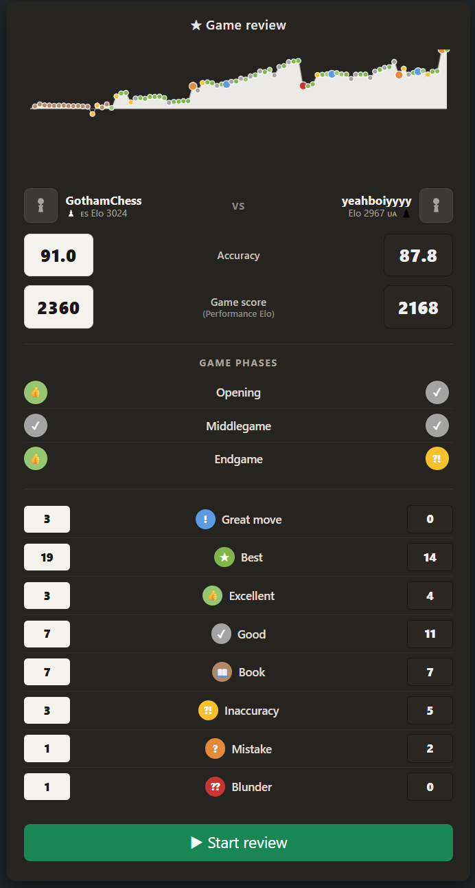
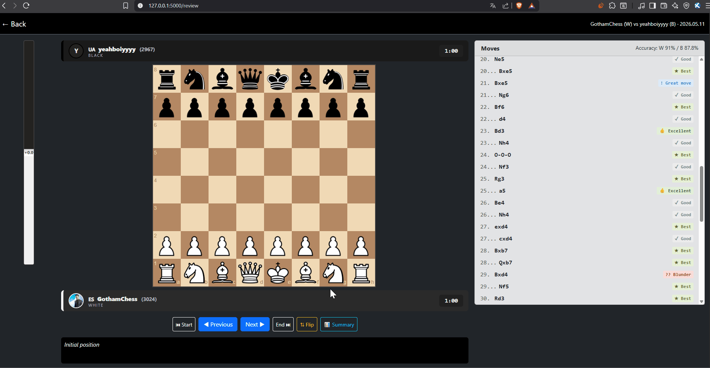

# local-chess-review

A **local** web app for chess game review: it downloads your games via the
public API of the chess platform you play on, analyzes them locally with
[Stockfish](https://stockfishchess.org/), and shows an interactive board with
per-move tags (Best, Inaccuracy, Mistake, Blunder, Brilliant, …) and an eval
bar.

Designed to run on your PC.

Bilingual UI (Italian default, English optional), selectable from the
dashboard.

> [!IMPORTANT]
> ## Disclaimer
>
> - This is a **personal, non-commercial project for educational / study
>   purposes**.
> - It is **not** affiliated with, sponsored by, or endorsed by any chess
>   service provider.
> - Game data is fetched **only through the documented public HTTP API** of
>   the chosen chess platform. No scraping, no credentials, no private
>   sessions, no undocumented APIs.
> - **All analysis runs locally** on the user's machine: there is no own
>   server that receives, stores, or redistributes any game.
> - The visual style is generic (Bootstrap 5 + chessboard.js) and does not
>   reproduce trademarks, logos, or assets of any third party provider.
> - The user is responsible for complying with the Terms of Service of the
>   platform they download their games from, in particular the rate limits
>   of the public API.
> - **Stockfish** is a free open-source chess engine distributed under the
>   GPLv3 license: it is free to download and use, but the executable is
>   **not included** in this repository (see *Setup*).
> - The puzzles (optional, shown during loading) come from the
>   [Lichess Puzzle Database](https://database.lichess.org/), released
>   under the CC0 license.

---

## Main features

- 📥 Download of the **current month's games** for the specified user.
- 🐟 Analysis with **local Stockfish** (configurable depth, default 15).
- 🏷️ Per-move tags: *Brilliant, Great move, Best, Excellent, Good, Book,
  Inaccuracy, Mistake, Missed opportunity, Blunder* (Win-Probability based
  *Expected Points* model).
- 📊 **Summary screen**: accuracy %, *Performance Elo* per player, WP
  chart, game phases (Opening / Middlegame / Endgame).
- ▶️ **Interactive review** move by move with tactical commentary, arrow
  pointing at the best move, and *variation explorer*.
- 🧩 **Mini Lichess puzzle** while you wait for the analysis.
- 🌍 Bilingual UI **IT / EN**.
- 📱 Reachable from your phone on the same Wi-Fi network.

---

## Preview

**Dashboard** — search a username, see the current month's games with
country flag, post-game Elo and cadence:



**Mini-puzzle during analysis loading** — a Lichess puzzle keeps you busy
while Stockfish chews through the game:



**Summary screen** — accuracy %, Performance Elo, Win-Probability chart
and game phases:



**Interactive review** — move tags, eval bar, best-move arrow,
variation explorer (drag *or* click-to-move):



---

## Quick start (Windows) — no install required

1. Go to the **[Releases](../../releases)** page of this repository.
2. Download the latest `ChessReview-windows.zip` (~85 MB).
3. Extract the zip anywhere on your PC.
4. Double-click **`ChessReview.exe`**.

That's it. A small console window opens with the server logs, and after
~1 second your default browser opens automatically on
<http://127.0.0.1:5000>. No Python install, no `pip`, no command line.

To close the app, simply close the console window.

> [!NOTE]
> The first time you run it, Windows SmartScreen may show
> *"Windows protected your PC"* because the `.exe` is not code-signed.
> Click **More info → Run anyway**. The app is open-source and runs entirely
> on your machine — no data leaves your PC. (A signing certificate is paid;
> without one this warning is unavoidable.)

### Use from your phone (same Wi-Fi)

The app also listens on your LAN, so you can review games from your phone
while the PC does the analysis:

1. On the PC, open PowerShell and run `ipconfig`. Look for "IPv4 Address"
   of the Wi-Fi adapter (e.g. `192.168.1.42`).
2. On the phone, open the browser and go to `http://192.168.1.42:5000`.
3. **Firewall**: the first time, Windows asks whether to allow incoming
   connections → choose "Private networks". If the app does not respond,
   create an inbound rule in Windows Defender Firewall that opens TCP
   port 5000.

### Optional: enable the loading-screen puzzles

The mini-puzzles shown during analysis loading require a local Lichess
puzzle DB (~20 MiB). It is not bundled in the zip to keep it small. To
enable it, you have two options:

- **Easy**: drop your own `puzzles.db` into the `engine\` folder next to
  `ChessReview.exe`.
- **From scratch**: see the *Development setup → Lichess puzzles* section
  below to generate it.

---

## How to use

1. **Dashboard** (`/`): pick the language, type a username from your
   chess platform (the app uses its public read-only games API), press
   *Search*. Games for the current month appear sorted from most recent
   first.
2. Click **Analyze**: Stockfish analysis starts (1–3 minutes at depth 15).
   While you wait, a mini-puzzle and a progress bar are shown.
3. The **Summary screen** appears: accuracy %, Performance Elo,
   Win-Probability chart, game phases.
4. Press **▶ Start review** to enter move-by-move mode:
   - centered board, oriented from the searched player's POV;
   - eval bar on the left;
   - per-move tag overlay on the destination square + arrow on the best
     move when you make a mistake;
   - moves list on the right;
   - **variation explorer**: drag a piece to play an alternative move —
     eval bar and best-move arrow update live.

---

## Development setup

This section is **only** for hacking on the code. End users should follow
the *Quick start* above.

### 1. Python and dependencies

```powershell
python -m venv .venv
.\.venv\Scripts\Activate.ps1
pip install -r requirements.txt
```

### 2. Stockfish

1. Download the latest build from
   <https://stockfishchess.org/download/> (Windows → `avx2` build; if your
   CPU does not support it, use `popcnt`).
2. Extract the zip.
3. Copy the executable into `engine/`, renaming it to **`stockfish.exe`**:

   ```text
   engine/stockfish.exe
   ```

The app looks for the executable at `engine/stockfish.exe` (Windows) or
`engine/stockfish` (Linux / macOS).

### 3. (Optional) Lichess puzzle database

Generates `engine/puzzles.db` (~20 MiB), used by the mini-puzzles in the
loading screen:

```powershell
python scripts\download_puzzles.py
```

Downloads ~250 MB compressed from `database.lichess.org`, filters in
streaming. Without the DB the rest of the app still works.

To shrink an existing DB without re-downloading:

```powershell
python scripts\trim_puzzles.py --per-band 5000
```

### 4. Run the dev server

```powershell
.\.venv\Scripts\Activate.ps1
python app.py
```

The console prints the URLs the app is reachable on. Open
<http://127.0.0.1:5000>.

For higher precision (slower):

```powershell
$env:REVIEW_DEPTH = "18"
python app.py
```

### 5. Build the standalone `.exe`

To produce the `ChessReview.exe` distributed via Releases:

```powershell
pip install -r requirements-dev.txt   # one-time: adds pyinstaller
.\build.ps1 -Clean -Zip
```

Output:

- `dist\ChessReview\` — the runnable folder (`ChessReview.exe` + bundled
  `_internal\`)
- `dist\ChessReview-windows.zip` — the archive to attach to a
  **GitHub Release** (~85 MB; GitHub Releases allow up to 2 GB per file)

If you want to ship without bundling Stockfish, simply remove
`engine\stockfish.exe` before building: end users will then need to drop
their own copy next to the `.exe`.

---

## Tech stack

- **Backend**: Python 3, [Flask](https://flask.palletsprojects.com/),
  [python-chess](https://python-chess.readthedocs.io/),
  [Stockfish](https://stockfishchess.org/) (external engine).
- **Frontend**: Bootstrap 5, jQuery,
  [chessboard.js](https://chessboardjs.com/),
  [chess.js](https://github.com/jhlywa/chess.js),
  [Chart.js](https://www.chartjs.org/) — all loaded from CDN.
- **Local DB (optional)**: SQLite + Lichess puzzle dataset.

---

## Project structure

```text
local-chess-review/
├── app.py                  # Flask server + API endpoints
├── chess_api.py            # public API wrapper (game download)
├── analyzer.py             # engine + move classification algorithm
├── requirements.txt        # runtime dependencies
├── requirements-dev.txt    # extra deps to build the standalone .exe
├── chessreview.spec        # PyInstaller build config
├── build.ps1               # builds dist\ChessReview\ChessReview.exe
├── start.ps1               # quick launcher for dev mode
├── scripts/
│   ├── download_puzzles.py # one-shot: downloads + filters Lichess puzzles
│   └── trim_puzzles.py     # one-shot: trims an existing puzzles.db
├── engine/
│   ├── README.txt          # how to download Stockfish
│   ├── stockfish.exe       # (DOWNLOAD MANUALLY)
│   └── puzzles.db          # (CREATED BY scripts\download_puzzles.py)
├── templates/
│   ├── index.html          # dashboard: search + games list
│   └── review.html         # interactive review page
└── static/
    ├── css/style.css
    └── js/
        ├── i18n.js         # IT/EN dictionaries + t() helper
        ├── index.js
        └── review.js
```

---

## Quick customizations

- **More precision → slower**: increase `REVIEW_DEPTH` (env) or `depth=`
  in `GameAnalyzer`.
- **Classification thresholds**: `WP_THRESHOLDS` in `analyzer.py` (in WP).
- **Brilliant more / less restrictive**: `BRILLIANT_SEE_MAX`,
  `BRILLIANT_WP_FLOOR`, `BRILLIANT_WP_CEILING`, `BRILLIANT_2ND_GAP`.
- **Longer book detection**: raise `BOOK_PLY` (default 16 plies).
- **Add a third UI language**: add another sub-dictionary in
  `static/js/i18n.js` and a matching `<option>` in the language selector
  in `templates/index.html`.

---

## Troubleshooting

- **`Stockfish not found`** → check that `engine/stockfish.exe` exists.
- **403 / rate limit from the API** → User-Agent too generic or too many
  requests. Increase the delay or customize the header in `chess_api.py`.
- **Phone can't see the PC** → Windows firewall: allow inbound TCP port
  5000 for private networks; PC and phone must be on the same Wi-Fi.
- **Analysis too slow** → lower `REVIEW_DEPTH` (e.g. 12) or pick a
  shorter game.
- **"Puzzle DB not installed"** → run `python scripts\download_puzzles.py` once.
